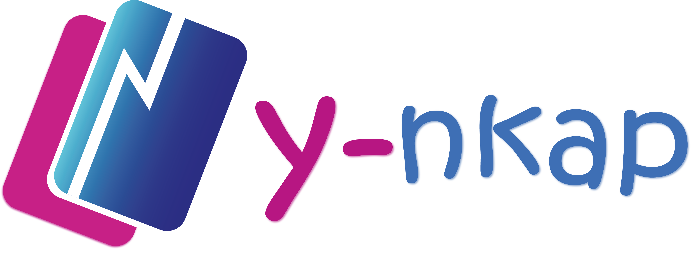

<h1 align="center">Y-Nkap</h1>

<p align="center">
  <br>
  
  <br><br>
  <i><b> Y-Nkap: </b>a platform (integrator) to manage payments on all merchant web sites.
    <br>Developed by Yaba-In, a software development company (desktop, web and mobile).</i>
  <br>
</p>

<p align="center">By:
  <a href="https://yaba-in.com" target="_blank"><strong>Yaba-In</strong></a>
  <br>
</p>


<hr>

## Documentation

Get started with Angular CLI, learn the fundamentals and explore advanced topics on documentation website.

- [Getting started](https://angular.io/start)
- [CLI](https://angular.io/cli)
- [Workspace and project file structure](https://angular.io/guide/file-structure)
- [Workspace configuration](https://angular.io/guide/workspace-config)
- [Schematics](https://angular.io/guide/schematics)


## Development Setup


### Prerequisites

- Install [Node.js] which includes [Node Package Manager][npm]

### Setting Up a Project

Install the Angular CLI globally:

```
npm install -g @angular/cli
```

Open the project directory:

```
cd [PROJECT DIRECTORY]
```

Packages installation:

```
npm i
```

Start project

```
ng serve --open
```


**Yaba-In, your software solution compagny.**


© 2022 Yaba-In

